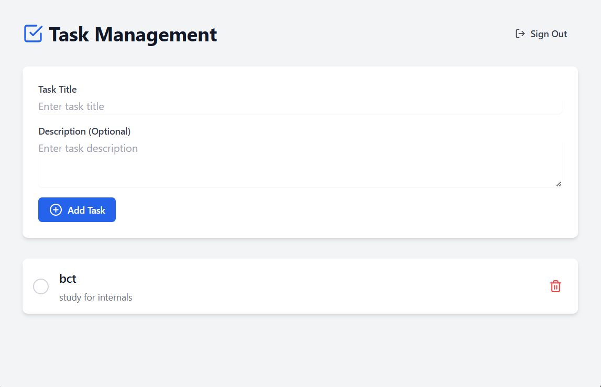
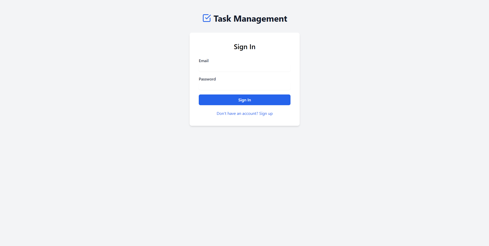

# Task Management Application

A modern task management application built with React, TypeScript, and Supabase. This application allows users to create, manage, and track their tasks with a beautiful and intuitive interface.



## Features

- 🔐 User authentication (sign up/sign in)
- ✨ Create, read, update, and delete tasks
- 📝 Add optional descriptions to tasks
- ✅ Mark tasks as complete/incomplete
- 🎨 Beautiful, responsive UI with Tailwind CSS
- 🔄 Real-time updates
- 🚀 Fast and efficient with Vite

## Prerequisites

- Node.js (v18 or higher)
- npm (v8 or higher)

## Installation

1. Clone the repository:
```bash
git clone <repository-url>
cd task-management-app
```

2. Install dependencies:
```bash
npm install
```

3. Create a `.env` file in the root directory with your Supabase credentials:
```env
VITE_SUPABASE_URL=your_supabase_url
VITE_SUPABASE_ANON_KEY=your_supabase_anon_key
```

4. Start the development server:
```bash
npm run dev
```

The application will be available at `http://localhost:5173`

## API Documentation

The application uses Supabase as the backend. Here are the main API endpoints:

### Authentication

#### Sign Up
```typescript
const { data, error } = await supabase.auth.signUp({
  email: string,
  password: string
});
```

#### Sign In
```typescript
const { data, error } = await supabase.auth.signInWithPassword({
  email: string,
  password: string
});
```

#### Sign Out
```typescript
const { error } = await supabase.auth.signOut();
```

### Tasks

#### Get Tasks
```typescript
const { data, error } = await supabase
  .from('tasks')
  .select('*')
  .order('created_at', { ascending: false });
```

#### Create Task
```typescript
const { data, error } = await supabase
  .from('tasks')
  .insert([{ 
    title: string,
    description: string | null
  }]);
```

#### Update Task
```typescript
const { data, error } = await supabase
  .from('tasks')
  .update({ completed: boolean })
  .eq('id', taskId);
```

#### Delete Task
```typescript
const { data, error } = await supabase
  .from('tasks')
  .delete()
  .eq('id', taskId);
```

## Testing with Postman

1. Create a new collection in Postman
2. Set up environment variables:
   - `SUPABASE_URL`: Your Supabase project URL
   - `ANON_KEY`: Your Supabase anon key

3. Authentication Header:
   ```
   apikey: {{ANON_KEY}}
   ```

4. Example Requests:

   ### Sign Up
   ```
   POST {{SUPABASE_URL}}/auth/v1/signup
   Content-Type: application/json
   
   {
     "email": "user@example.com",
     "password": "your_password"
   }
   ```

   ### Sign In
   ```
   POST {{SUPABASE_URL}}/auth/v1/token?grant_type=password
   Content-Type: application/json
   
   {
     "email": "user@example.com",
     "password": "your_password"
   }
   ```

   ### Get Tasks
   ```
   GET {{SUPABASE_URL}}/rest/v1/tasks?select=*
   Authorization: Bearer {{ACCESS_TOKEN}}
   ```

## Database Schema

```sql
CREATE TABLE tasks (
  id uuid PRIMARY KEY DEFAULT gen_random_uuid(),
  title text NOT NULL,
  description text,
  completed boolean DEFAULT false,
  created_at timestamptz DEFAULT now(),
  user_id uuid DEFAULT auth.uid() REFERENCES auth.users(id) ON DELETE CASCADE
);
```

## UI Screenshots

### Authentication Page


### Task Management Dashboard


## Security

- Row Level Security (RLS) is enabled on all tables
- Users can only access their own tasks
- Authentication is handled securely by Supabase
- All API requests require authentication

## Contributing

1. Fork the repository
2. Create your feature branch (`git checkout -b feature/amazing-feature`)
3. Commit your changes (`git commit -m 'Add some amazing feature'`)
4. Push to the branch (`git push origin feature/amazing-feature`)
5. Open a Pull Request

## License

This project is licensed under the MIT License - see the LICENSE file for details.
